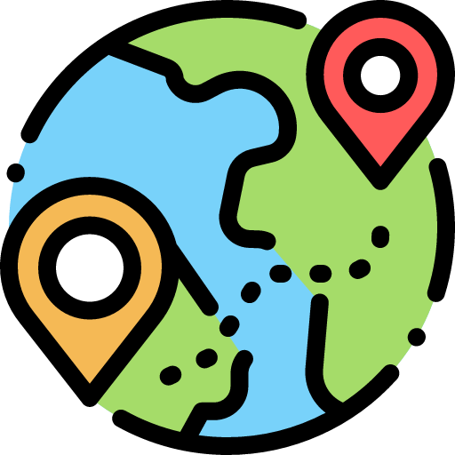

# Quintry

**Quintry** is an interactive geography quiz application that tests your knowledge of world ports. Challenge yourself to identify port locations on a world map across different regions and difficulty levels.



## Features

- **Interactive World Map**: Click and zoom to explore ports around the globe
- **Multiple Regions**: Quiz yourself on World, Asia, Europe, Americas, Africa, or Oceania
- **Three Difficulty Levels**:
  - **Easy**: Shows port name with country in dropdowns
  - **Normal**: Port name only with 2 decoy ports per question
  - **Hard**: Port name only with 5 decoy ports per question
- **Customizable Quizzes**: Choose the number of ports and filter by regions or countries
- **Browse Ports Encyclopedia**: Explore and learn about thousands of ports worldwide
- **Custom Lists**: Create and manage custom port lists for focused practice
- **Real-time Scoring**: Track your accuracy and completion time
- **Detailed Results**: Review correct and incorrect answers with map visualization

## Download

### Pre-built Releases

- **macOS**: Download the `.dmg` file from the [Releases](../../releases) page
- **Windows/Linux**: Build from source (see instructions below)

## Building from Source

If you'd like to build Quintry yourself, follow the instructions for your operating system below.

### Prerequisites

Before building, you'll need to install:

1. **Node.js** (v18 or higher)
   - Download from [nodejs.org](https://nodejs.org/)
   - Verify installation: `node --version`

2. **Rust** (for Tauri)
   - Install via [rustup.rs](https://rustup.rs/)
   - Verify installation: `rustc --version`

3. **System Dependencies** (platform-specific):

#### Windows
- **Microsoft Visual Studio C++ Build Tools**
  - Download from [Visual Studio](https://visualstudio.microsoft.com/visual-cpp-build-tools/)
  - Install "Desktop development with C++" workload
- **WebView2** (usually pre-installed on Windows 10/11)

#### macOS
- **Xcode Command Line Tools**
  ```bash
  xcode-select --install
  ```

#### Linux (Debian/Ubuntu)
```bash
sudo apt update
sudo apt install libwebkit2gtk-4.1-dev \
  build-essential \
  curl \
  wget \
  file \
  libxdo-dev \
  libssl-dev \
  libayatana-appindicator3-dev \
  librsvg2-dev
```

#### Linux (Fedora)
```bash
sudo dnf install webkit2gtk4.1-devel \
  openssl-devel \
  curl \
  wget \
  file \
  libappindicator-gtk3-devel \
  librsvg2-devel
sudo dnf group install "C Development Tools and Libraries"
```

#### Linux (Arch)
```bash
sudo pacman -Syu
sudo pacman -S --needed \
  webkit2gtk-4.1 \
  base-devel \
  curl \
  wget \
  file \
  openssl \
  appmenu-gtk-module \
  gtk3 \
  libappindicator-gtk3 \
  librsvg \
  libvips
```

### Build Instructions

1. **Clone the repository**
   ```bash
   git clone https://github.com/yourusername/Quintry.git
   cd Quintry
   ```

2. **Install dependencies**
   ```bash
   npm install
   ```

3. **Build the application**
   ```bash
   npm run tauri build
   ```

4. **Locate your build**

   After building, find your installer in:

   - **Windows**: `src-tauri/target/release/bundle/nsis/Quintry_0.1.0_x64-setup.exe`
   - **macOS**: `src-tauri/target/release/bundle/dmg/Quintry_0.1.0_universal.dmg`
   - **Linux**:
     - DEB: `src-tauri/target/release/bundle/deb/quintry_0.1.0_amd64.deb`
     - AppImage: `src-tauri/target/release/bundle/appimage/quintry_0.1.0_amd64.AppImage`

### Development Mode

To run the app in development mode with hot-reload:

```bash
npm run tauri dev
```

## Usage

1. **Configure Your Quiz**
   - Select regions (World, Asia, Europe, etc.)
   - Choose difficulty level (Easy, Normal, Hard)
   - Set the number of ports
   - Optionally filter by specific countries or use custom lists

2. **Start the Quiz**
   - Click "Begin Quiz" to start
   - Ports will appear as lettered markers on the map
   - Select the correct port name for each letter from the dropdown

3. **Submit and Review**
   - Submit your answers when ready
   - Review your score and see which answers were correct
   - Click on results to center the map on specific ports

4. **Browse Ports**
   - Use the "Browse Ports" tab to explore all available ports
   - Search and filter to learn about different locations
   - Add ports to custom lists for future quizzes

5. **Create Custom Lists**
   - Navigate to the "Lists" tab
   - Create themed lists (e.g., "Major European Ports", "Asian Cargo Hubs")
   - Add ports from the Browse tab or manage existing lists

## Technology Stack

- **Frontend**: React 19 + TypeScript + Tailwind CSS
- **Desktop Framework**: Tauri 2
- **Mapping**: react-simple-maps + D3.js
- **Build Tool**: Vite

## Troubleshooting

### Build Errors

**"error: failed to run custom build command for..."**
- Ensure all system dependencies are installed (see Prerequisites)
- Try updating Rust: `rustup update`

**"Could not find required packages"** (Linux)
- Double-check that all apt/dnf/pacman packages are installed
- Try installing them one by one to identify the missing package

**"MSVCP140.dll not found"** (Windows)
- Install Visual C++ Redistributable from [Microsoft](https://learn.microsoft.com/en-us/cpp/windows/latest-supported-vc-redist)

### Runtime Issues

**App won't open on macOS**
- Right-click the app → "Open" to bypass Gatekeeper
- Or run: `xattr -cr /Applications/Quintry.app`

**Blank screen on launch**
- Clear app cache and restart
- Check console for errors in dev mode

## Contributing

Contributions are welcome! Feel free to:
- Report bugs by opening an issue
- Suggest new features
- Submit pull requests

## License

This project is open source. See LICENSE file for details.

## Credits

Port data sourced from maritime databases and geographic information systems.

---

**Happy Quizzing!** Test your maritime geography knowledge and become a port expert.
